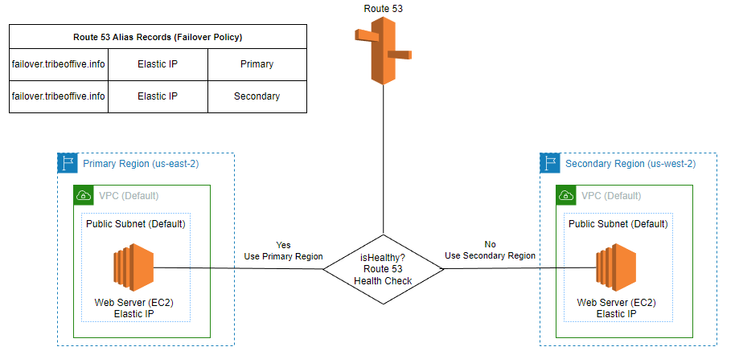

# AWS Route 53 Failover Demo

This demo uses Route 53 DNS failover policies to test a failover across two AWS regions. It uses Terraform to create the infrastructure. It uses and cripts to cause a failure of the primary region EC2 instance.  When the failure occurs the Route 53 health check recognize the failure and return the DNS record for the EC2 in the secondary region. The goal is to understand how Route 53 DNS failover works and how the configuration parameters affect the failover time.


The Terraform creates:
- Two EC2 instances, with a web server installed, in two AWS regions
    - Primary: Ohio (us-east-2) 
    - Secondary: Oregon (us-west-2)
- Two Elastic IP addresses for each of the EC2 instances
- Two Route 53 alias records for each of the EC2 elastic ip addresses with the same name of ```failover.tribeoffive.com```
- Two Route 53 health checks that point to the EC2 instance Elastic IP addresses
- ./scripts/variables.sh which includes the instance id of the primary regions EC2 instance and is used for the stop and start scripts




Once the Terraform is applied, these scripts simulate a failure and recovery
- ```./scripts/stop-primary.sh``` - Stops the EC2 instance in the primary region to simulate a failure
- ```./scripts/start-primary.sh``` - Starts the EC2 instance in the secondary region to simulate a recovery


## Setup Prerequisites

- An AWS account 
- AWS CLI installed
- Terraform 5.0 or greater installed
- An existing default VPC with a public subnet 
- An existing Route 53 Hosted Zone for your domain. 
    - GoDaddy is my registrar and I use Route 53 for my DNS service.   [How to use GoDaddy as the registrar and to Route 53 as the DNS service?](docs/GoDaddyToRoute53.md). 
    - The Terraform will lookup my existing Route 53 hosted zone:
    ``` terraform
    # Get the existing Route53 Hosted zone
    data "aws_route53_zone" "selected" {
        name         = var.hostedzone_name # set to tribeoffive.com
        private_zone = false
    }
    ```
You could also use Terraform to create our own hosted zone.  See the [Terraform Route 53 Zone](https://registry.terraform.io/providers/hashicorp/aws/latest/docs/resources/route53_zone) documentation for more information.

## Steps to Install and Run

1. Run the Terraform to create the infrastructure.
    ``` bash
    $ terraform init
    $ terraform apply
    ```
2. Run the dig command to get elastic IP address **3.12.27.89** of the primary region EC2 instance in **us-east-2**.
    ``` bash

    $ dig failover.tribeoffive.info
    ;; ANSWER SECTION:
    failover.tribeoffive.info. 60   IN      A       3.12.27.89
    ```

3. Run curl to get the response back from the primary web server. Notice it is in **us-east-2**.
    ``` bash
    $ curl failover.tribeoffive.info
    <h1>Hello world from ip-172-31-27-33.us-east-2.compute.internal in AZ us-east-2b </h1>
    ```

4. Stop the primary EC2 instance to simulate a failure
    ``` bash
    $ ./scripts/stop-primary.sh
    {
    "StoppingInstances": [
        {
            "CurrentState": {
                "Code": 64,
                "Name": "stopping"
            },
            "InstanceId": "i-0e4fa9a724430b8c6",
            "PreviousState": {
                "Code": 16,
                "Name": "running"
            }
        }
    ]
    }
    ```

5. Wait for the failover to happen  
    - It takes time for the EC2 instance to stop
    - The Route 53 are configured to take a minimum of 1.5 minutes to detect a failure 

6. Run the dig command until it returns the elastic IP address **54.186.16.116** of the secondary EC2 instance in region **us-west-2**.
     ``` bash

    $ dig failover.tribeoffive.info
    ;; ANSWER SECTION:
    failover.tribeoffive.info. 60   IN      A       54.186.16.116
    ```

7. Run curl to get the response back from the secondary web server
    ``` bash
    $ curl failover.tribeoffive.info
    <h1>Hello world from ip-172-31-35-250.us-west-2.compute.internal in AZ us-west-2a </h1>
    ```

8. Start the primary EC2 instance to simulate a recovery
    ``` bash
    $ ./scripts/start-primary.sh
    {
    "StartingInstances": [
        {
            "CurrentState": {
                "Code": 0,
                "Name": "pending"
            },
            "InstanceId": "i-0e4fa9a724430b8c6",
            "PreviousState": {
                "Code": 80,
                "Name": "stopped"
            }
        }
    ]
    }
    ```
9. Wait for the recovery to happen  
    - It takes time for the EC2 instance to start
    - The Route 53 are configured to take a minimum of 1.5 minutes to detect a recovery
10. Run the dig command until it returns the elastic IP address **3.12.27.89** of the primary region EC2 instance in **us-east-2**
     ``` bash
    ;; ANSWER SECTION:
    failover.tribeoffive.info. 60   IN      A       3.12.27.89
    ```
11. Run curl to get the response back from the primary web server in us-east-2
    ``` bash
    $ curl failover.tribeoffive.info
    <h1>Hello world from ip-172-31-27-33.us-east-2.compute.internal in AZ us-east-2b </h1>
    ```
12. Success!  You have simulated a failure and recovery using Route 53.
