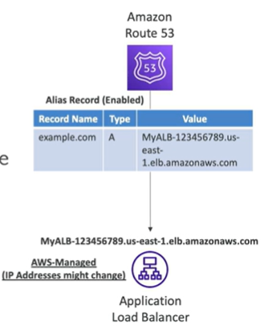

# CNAME vs Alias

- AWS Resources (Load Balancer, CloudFront, S3, etc.) expose a AWS hostname:
    - lb-1234.us-east-2.elb.amazonaws.com and you want to use a friendly hostname like www.example.com

- CNAME
    - Points a hostname to another hostname (app.mydomain.com => blabla.anything.com)
    - Only for non-root domain (aka. something.example.com)

- Alias
    - Points a hostname to a AWS Resource (app.mydomain.com => blabla.amazonaws.com)
    - Works for ROOT DOMAIN and NON ROOT domain (aka.something.example.com and example.com)
    - Free of charge
    - Native health check

- Route 53 - Alias Record
    - Map a hostname to a AWS resource
    - An extension of DNS functionality
    - Automatically recognizes changes in the resources IP address
    - Unlike CNAME, it can be used for the top node of the DNS namespace (aka mydomain.com)
    - Alias Records is always of type A/AAAA for AWS resources (IPv4/IPv6)
    - You can't set the TTL

- Route 53 - Alias Record targets
    - Load Balancers (ELB, NLB, ALB)
    - CloudFront Distribution
    - API Gateway
    - S3 Website Bucket
    - Another Route 53 Record in the same Hosted Zone (example.com => test.example.com)
    - Elastic Beanstalk Environment
    - AWS Global Accelerator
    - AWS VPC Endpoint
    - AWS Cloud Map Service

    - You CANNOT use an Alias for a EC2 DNS name (ec2.amazonaws.com)