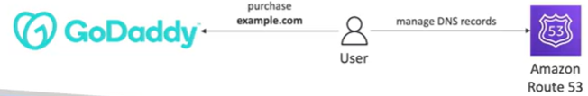

# Domain Registrar vs DNS

- You can buy your domain name with a Domain Registrar typically by paying annually
- The Domain Registrar usually provides you with a DNS service to manage your DNS records
- But you can use another DNS service to manage your DNS records
- Example: purchase the domain from GoDaddy and use Route53 to manage your DNS records

## 3rd Party Registrar with Amazon Route 53

- If you buy your domain on a 3rd party registrar, you can still use Route53 as the DNS service provider

1. Create a Hosted Zone in Route53
2. Update the NS Records on 3rd party website to use Route 53 Name Servers