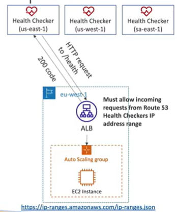
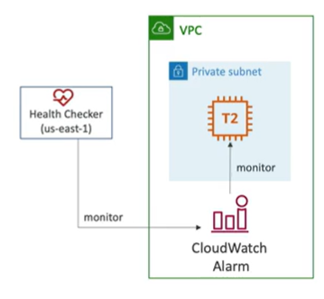

# Health Checks - Monitor and Endpoint

- About 15 global health checkers will check the endpoint health
    - Healthy/Unhealthy Threshold - 3 (default)
    - Interval - 30 seconds (can set to 10 sec - higher cost)
    - Supported protocols: HTTP, HTTPS, TCP
    - if > 18% of health checkers report healthy, Route 53 considers it Healthy. Otherwise it is unhealthy
    - Ability to choose which locations you want Route 53 to use

- Health checks pass only when the endpoint responds with a 2xx or 3xx status code
    - 2xx - Success
    - 3xx - Redirection

- Health checks can be setup to pass/fail based on text in the first 5120 bytes of the response

- Configure your router/firewall to allow incoming traffic from the Route 53 health checkers

## Calculated Health Checks

- Calculated health checks let you check the health of your resources as a group
- You can use OR, AND, or NOT
- Can monitor up to 256 resources in a single health check
- Specify how many of the health checks need to pass to make the parent pass
- Usage: perform maintenance to your website without causing all health checks to fail

## Health Checks - Private Hosted Zones
- Route 53 health checkers are outside the VPC
- They can't access private endpoints (private VPC or on-premise resource)

- You can create a CloudWatch Metric and associate a CloudWatch Alarm, then create a Health Check that checks the alarm itself

