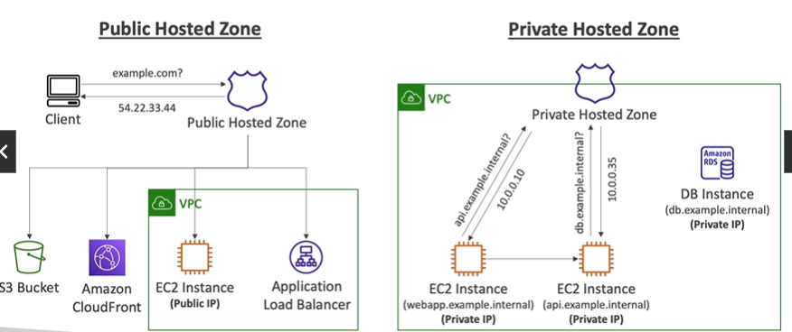

# Hosted Zones

- A container for records that define how to route traffic to a domain and its subdomains
- Public Hosted Zones - contains records that specify how to route traffic on the Internet (public domain names).  You buy a domain name from a registrar and then create a public hosted zone to route traffic to your resources.  Public domain name would e something like example.com
- Private Hosted Zones - contains records that specify how to route traffice within one or more VPC's (private domain names).  Example would be company.internal
- You pay $0.50 per month for each hosted zone

