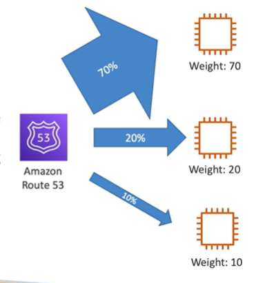

# Route 53 - Routing Policy

- Define how Route 53 should respond to DNS queries
- Don't get confused with the term "Routing" - it has nothing to do with Route Tables or Internet Gateway

- Route 53 supports the following routing types:
    - Simple Routing
    - Weighted Routing
    - Latency-based Routing
    - Failover Routing
    - Geolocation Routing
    - Geoproximity Routing (Traffic Flow Only)
    - Multivalue Answer Routing

## Simple Routing

- Typically used when you have a single resource that performs a given function for your domain
- Can specify multiple values for the same record
- If multiple values are returned, a random one is chosen by the client
- When alias enabled, specify only one AWS resource
- Can't be associated with a health check

## Weighted Routing

- Controls the % of the requests that go to different resources
- Assign a weight to each record:
    - traffic % = weight of specific record / sum of weights of all records
    - Weights don't need to sum up to 100
- DNS records must have the same name and type
- Can be associated with a health check
- Use cases: load balancing between regions, testing new app versions

## Latency-based Routing

- Redirect to the resource that has the least latency close to the user
- Super helpful when latency is a key factor
- Latency is evaluated in terms of user to designated AWS Region
- Germany users may be directed to the US (if that's the lowest latency)
- Can be associated with a health check (has a failover capability)

## [Failover Routing](./RoutingPolicyFailover.md)

## [Geolocation Routing](./RoutingPolicyGeolocation.md)

## [Geoproximity Routing](./RoutingPolicyGeoproximity.md)

## [Multivalue Answer Routing](./RoutingPolicyMultivalue.md)