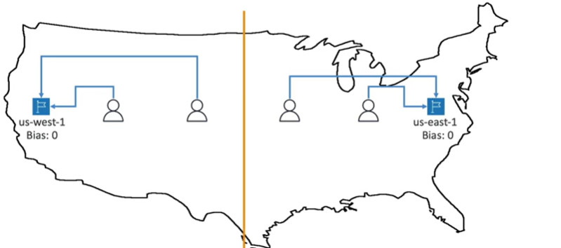

# Geoproximity Routing Policy

- Route traffic to your resources based on the geographic location of your users and your resources
- You can also optionally choose to route more traffic or less to a given resource by specifying a value, known as a bias
- To change the size of a geographic region, you can specify a bias value
    - To expand (1 to 99)- more traffic to the resource
    - To shrink (1 to 99)- less traffic to the resource

- Resources can be:
    - AWS resources (specify AWS region)
    - Non-AWS resources (specify Latitude and Longitude)

- You must use Route 53 Traffic Flow (advanced) to create a geoproximity routing policy

When no bias the routing is based on the distance:

Bias changes that. The example below shows a higher-bias in us-east-1, so more traffic will be routed to that region:

