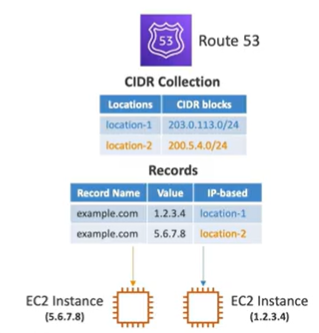

# Routing Policies - IP-Based Routing

- Routing is based on clients IP addresses
- You provide a list of CIDRs for your clients and the corresponding endpoints/locations(user-IP-to-endpoint mapping)
- Use cases: route end users from a particular ISP to a specific endpoint, route mobile traffic to a specific endpoint, route traffic from on-premise to a specific endpoint

