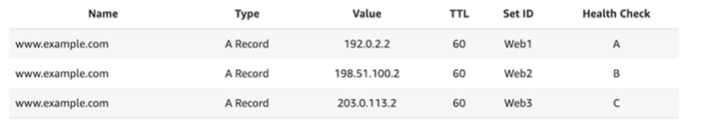

# Routing Policies - Multi-Value Routing

- Used when routing traffic to multiple resources
- Route 53 return multiple values/resources
- Can be associated with Health Checks (return only values for healthy endpoints)
- Up to 8 healthy records are returned for each Multi-Value query
- Multi-Value routing policy cannot be associated with Alias records
- Multi-Value is not a substitute for having an ELB in front of your instances

