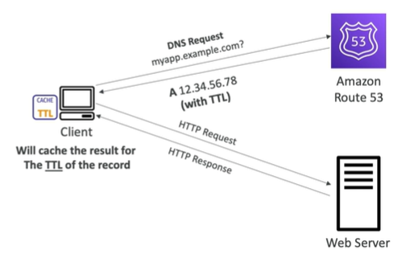

Route 53 - Records TTL (Time To Live)

- High TTL - e.g. 24 hours
    - Less DNS traffic
    - Less load on DNS servers
    - Possibly outdated records

- Low TTL - e.g. 1 minute
    - More DNS traffic
    - More load on DNS servers
    - More up-to-date records

- Except for Alias records, TTL is mandatory for each DNS record